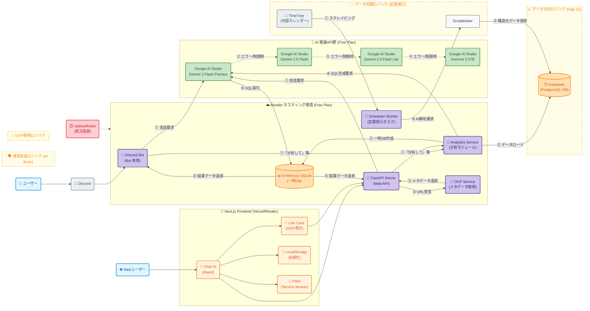

# 📘 AIまう プロジェクト仕様書

## 1. システムアーキテクチャ
**トリプルハイブリッド構成 & インメモリ分析基盤 & Web チャットUI**
APIの枯渇を防ぐフェイルセーフと、高度な質問に答えるための分析基盤、そしてWebブラウザからアクセス可能なチャットUIを兼ね備えています。



```

## 2. 会話・挙動ロジック

### 🧠 記憶と文脈

  * **履歴参照**: 
    * **Discord Bot**: 直近 **10件** の会話ログをチャンネル履歴から取得してプロンプトに含めて送信します。
    * **Web API**: フロントエンドから送信された直近 **12件** の会話履歴を受け取り、プロンプトに含めて送信します。
  * **文字数制限:** 返答は原則 **200文字以内** で、Twitterのリプライのようにテンポよく返します。
    * **例外:** ライブ情報の告知やスケジュール詳細を伝える場合は、情報量を優先し、文字数制限を無視して詳細に答えます。
  * **特典強調:** イベントに特典（Bonus）がある場合は、絵文字をつけて優先的にアピールします。
  * **動的サジェスト (Dynamic Suggestions):** 
    * AIが返答と同時に「次にユーザーが言いそうなこと」を3つ予測して提案します。
    * 通常会話時だけでなく、Reflexモード（キャッシュ応答）時にも簡易的なサジェストを提供します。

### 📊 高IQ分析機能 (High-IQ Analytics)

ユーザーからの高度な質問（例：「今月のライブ数は？」「次の予定は？」）に対して、以下のフローで回答します。

1.  **インメモリDB構築**: Supabaseから最新のスケジュールを取得し、メモリ上のSQLiteに展開（5分間キャッシュ）。
2.  **SQL生成**: Geminiが質問内容から SQLクエリ (`SELECT ...`) を生成。
    * **詳細優先**: スケジュール照会時は `place`, `price_details`, `ticket_url`, `bonus` を積極的に取得。
3.  **実行**: 生成されたSQLをSQLiteで安全に実行。
4.  **回答**: 実行結果（表データ）を基に、まうちゃんの人格で回答を生成。

### 🛡️ 応答トリガー (空気を読む機能)

`on_message` イベントにて以下の優先順位で判定します。

1.  **メンションされた場合 (`@AIまう`)**: 無条件で反応。
2.  **指定チャンネル**:
      - 他人へのメンションがある → 無視。
      - 独り言・全体チャット → 反応。
3.  **それ以外**: 無視。

### 👤 ユーザー名設定機能 (Webフロントエンド)
1. **初回アクセス判定**: LocalStorageにユーザー名が存在するかチェック。
2. **名前設定モーダル**: 存在しない場合、モーダルを表示して名前入力を促す。
3. **永続化**: 入力された名前をLocalStorageに保存し、以後の会話リクエストヘッダーまたはプロンプトに含める（現状はコンテキストに含めて送信）。

### 🔗 OGPリンクカード機能 (Webフロントエンド)

WebチャットではURLを含むメッセージに対して、以下の機能を提供します。

1.  **URL検出**: 正規表現でメッセージ内のURLを自動検出。
2.  **URLリンク化**: チャット内のURLをクリック可能なリンクに変換（新しいタブで開く）。
3.  **OGP取得**: バックエンドAPI (`/api/ogp`) を介してOGPメタデータを取得。
4.  **リッチカード表示**: 画像、タイトル、説明を含むカードを表示。
5.  **グレースフルデグラデーション**: OGP取得失敗時は空データを返し、シンプルなカードを表示。

## 3. ファイル構成 (Modular Monolith)

### バックエンド

| ディレクトリ    | ファイル名             | 役割                                          |
| :-------------- | :--------------------- | :-------------------------------------------- |
| `src/app/`      | `main.py`              | エントリーポイント。                          |
|                 | `bot.py`               | Discord Bot本体。メッセージ受信・応答制御。   |
|                 | `server.py`            | FastAPI サーバー。Web API & Discord Bot統合。 |
| `src/domain/`   | `ai_service.py`        | AI推論ロジック (Gemini / Groq)。              |
|                 | `analytics_service.py` | AIによるSQL分析・実行サービス。               |
|                 | `persona.py`           | AIへのシステムプロンプト定義。                |
| `src/services/` | `ogp_service.py`       | OGPメタデータ取得サービス。                   |
| `src/workers/`  | `scheduler.py`         | TimeTree同期ワーカー（AI補正・DryRun対応）。  |
|                 | `fetcher.py`           | 過去ログ取得用スクリプト。                    |
| `src/core/`     | `config.py`            | 環境変数と定数管理。                          |
|                 | `logger.py`            | ロギング設定。                                |

### Web API エンドポイント

| メソッド | パス                 | 概要                                                         |
| :------- | :------------------- | :----------------------------------------------------------- |
| `GET`    | `/`                  | サーバー稼働確認用（ルート）。                               |
| `GET`    | `/health`            | ヘルスチェック用。Renderの監視等に使用。                     |
| `POST`   | `/api/chat`          | チャット応答生成。`response`, `mode`, `suggestions` を返却。 |
| `POST`   | `/api/ogp`           | 指定URLのOGPメタデータ取得。                                 |
| `GET`    | `/api/sync-schedule` | スケジュール同期トリガー（要トークン）。UptimeRobot用。      |

### フロントエンド

| ディレクトリ               | ファイル名             | 役割                            |
| :------------------------- | :--------------------- | :------------------------------ |
| `frontend/src/app/`        | `page.tsx`             | メインチャットページ。          |
|                            | `layout.tsx`           | ルートレイアウト。              |
|                            | `globals.css`          | グローバルスタイル。            |
|                            | `manifest.ts`          | PWAマニフェスト生成。           |
| `frontend/src/components/` | `link-card.tsx`        | OGPリンクカードコンポーネント。 |
|                            | `name-input-modal.tsx` | ユーザー名入力モーダル。        |
| `frontend/src/hooks/`      | `use-local-storage.ts` | LocalStorage永続化フック。      |
| `frontend/src/lib/`        | `utils.ts`             | ユーティリティ関数。            |

## 4. 管理情報 (Service Stack)

| サービス             | 用途                   | プラン |
| :------------------- | :--------------------- | :----- |
| **Render**           | ホスティング           | Free   |
| **UptimeRobot**      | 死活監視               | Free   |
| **Supabase**         | データベース           | Free   |
| **Google AI Studio** | Gemini 3 Flash Preview | Free   |
| **Google AI Studio** | Gemini 2.5 Flash       | Free   |
| **Google AI Studio** | Gemini 2.5 Flash Lite  | Free   |
| **Google AI Studio** | Gemma 3 27B            | Free   |

## 5. データベース設計 (Supabase)

### `schedules` テーブル

  - `source_id` (PK): TimeTreeイベントID
  - `title`: イベント名
  - `start_at`: 開始日時 (ISO 8601)
  - `end_at`: 終了日時
  - `description`: 詳細メモ
  - `place`: 会場・場所
  - `ticket_url`: チケット購入URL
  - `price_details`: 料金詳細
  - `bonus`: 入場特典
